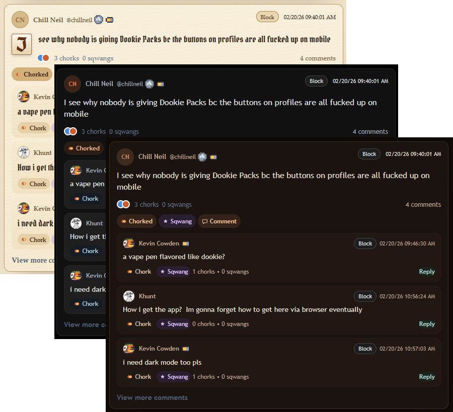
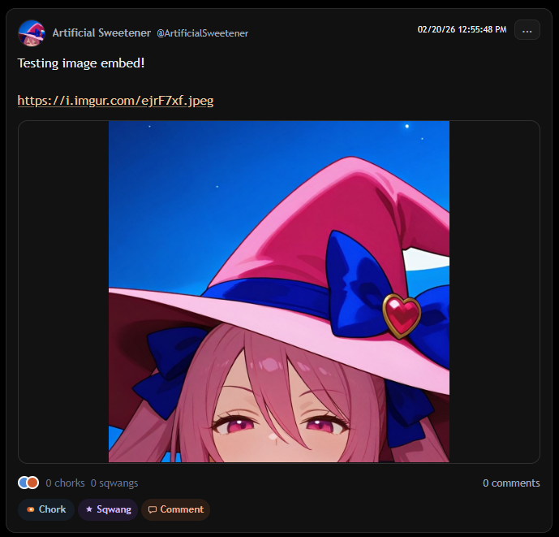
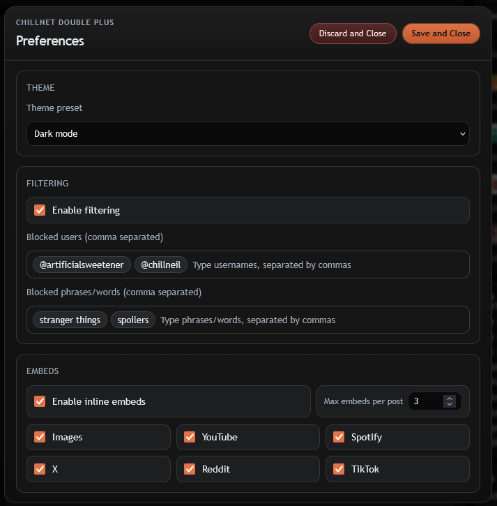

# Chillnet Double Plus

Chillnet is an interesting social website with a strong community. As soon as I loaded in for the first time, though, I was blinded by its bright theme. I built out a dark mode userscript, and then started thinking "well, what if...", piling on features I want that Chillnet doesn't have. I understand a lot of the simplicity is by design and it's part of what some people like about the site, which is why I've built this userscript to be fully configurable so you can get only what you want out of it!

## Installation

1. Install a userscript manager such as **[Violentmonkey](https://violentmonkey.github.io/)**, **[Tampermonkey](https://www.tampermonkey.net/)**, or **[FireMonkey](https://addons.mozilla.org/en-US/firefox/addon/firemonkey/)**.
2. Add the script (your preference of method):
   - From this repo: open [`chillnet-double-plus.user.js`](https://raw.githubusercontent.com/Artificial-Sweetener/chillnet-double-plus/main/chillnet-double-plus.user.js) and let your userscript manager import it.
   - Visit the [GreasyFork release page](https://greasyfork.org/en/scripts/566883-chillnet-double-plus) and click **install this script**.
3. Reload `https://chillnet.me/`.

## Features

Chillnet Double Plus is designed to keep the site familiar while giving you more range and control.

- **Theme Playground:** Switch between Original, Dark, Brown, Pink, Aurora, and Olden modes whenever you want.

  

<blockquote>
  
Theme presets in action.

</blockquote>

- **Filter Your Feed:** Block by username and block by phrase across post content.
- **Filter Comments Too:** Comment threads are filtered with summary counts, including detached permalink comment threads.
- **Filter Notifications:** Blocked users are filtered in both popup notifications and `/notifications/all`.
- **Clean the Right Rail:** Blocked users are removed from "Who to follow" and targeted scoreboard cards.

- **Inline Block Actions:** Use `Block` controls near post/comment timestamps and update your blocklist from where you are.
- **Rich Embeds:** Render images, YouTube, Spotify, X, Reddit, and TikTok inline with global and per-provider toggles.
- **Embed Limits:** Set max embeds per post from 1 to 6.
- **Cleaner Links:** Plain URLs are auto-linkified with compact middle-elided labels and hover tooltips.

  

<blockquote>
  
Inline media rendering inside the feed.

</blockquote>

## Using the Control Panel

- Open settings from userscript menu command: **`Chillnet Double Plus: Open Settings`**.
- Or use the **Double Plus** launcher in Chillnet's left rail.
- Theme, filtering, and embed controls live in one panel so tuning stays quick.

  

<blockquote>
  
Theme, filtering, and embed controls in one place.

</blockquote>

## Contributing & Support

- **Issues & Features:** Open an issue if Chillnet markup shifts or a feature breaks.
- **Pull Requests:** Yes please. Keep PRs focused and explain what changed.

## License

- **Base License:** GNU General Public License v3.0 (GPL-3.0-only). See [`LICENSE`](LICENSE).
- **Special License Exception (Chill Neil):**
  - Licensor: **Artificial Sweetener**.
  - Notwithstanding GPLv3 for the public, Licensor grants a separate, additional license to the individual publicly known as **Chill Neil**, identified as the owner and proprietor/operator of `chillnet.me` as of **February 20, 2026** ("Special Licensee").
  - For Licensor's copyright interests in this project, Special Licensee may use, copy, modify, distribute, sublicense, and relicense the software (source and binary) under terms of Special Licensee's choosing.
  - This special grant is personal to Special Licensee and does not automatically apply to any other person or entity.
  - All other recipients receive this software solely under GPLv3.

## From the Maintainer 💖

I made this because I like Chillnet but wanted just a little bit more control over my experience!

- **My Website & Socials:** See my art, poetry, and other dev updates at [artificialsweetener.ai](https://artificialsweetener.ai).
- **If you like this project:** it would mean a lot to me if you gave it a star on GitHub!! ⭐
